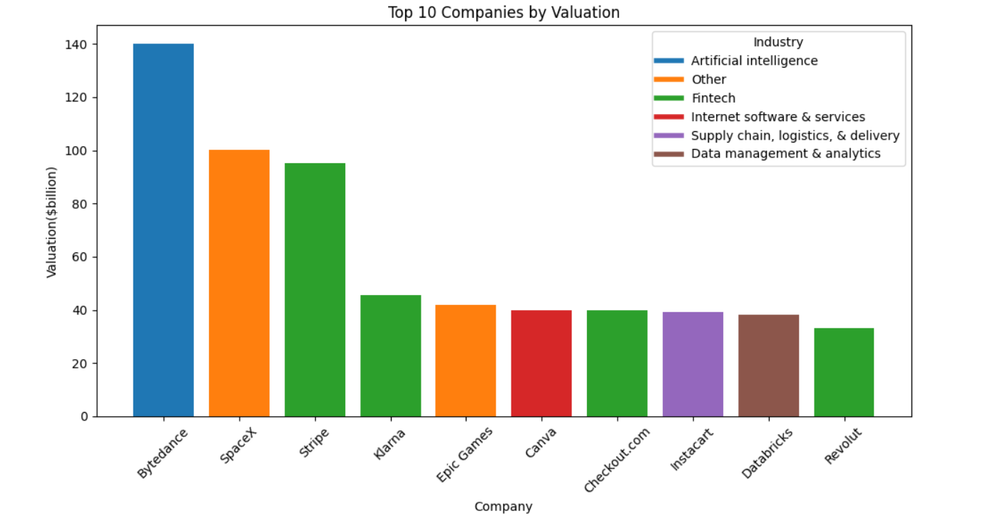

# Analyse Unicorn Companies using SQL

This is an interesting project that looks into unicorn companies. Unicorn companies are startup companies that have achieved a valuation of $1 billion or more. 

## Key questions
1. What are the top 10 companies with the highest valuation?

Focusing on the top 100 companies:

2. What industries are these companies in how many companies are there in each industries?
3. What is the average number of years to become a unicorn for each industries?
4. Which investors has the highest total valuation?
5. Which investors has the highest number of unicorns?

## Key Findings

1. ### Top 10 companies

  The top 10 companies in terms of valuations are:

4 out of these 10 companies are in Fintech. 

2. ### Industry sectors and number of companies in each industry

- Most of the top 100 companies are in Fintech, followed by Internet software and services

3. ### Average number of years to unicorn status

- The average years for a Fintech company to achieve unicorn status is approximately 6.5 years and it takes slightly longer for a company in internet software and services.

4. ### Investors with highest total valuation

5. ### Investors with highest number of unicorn companies

## The Project

### Datasets used
- [Unicorn Companies Dataset from Kaggle](https://www.kaggle.com/datasets/deepcontractor/unicorn-companies-dataset/discussion/431140
)

### Data Preprocessing

The following data cleanse was done using  `Pandas`:

1. `Valuation` column
    - removed the '$' sign preceeding every value
    - multiply all the values by a billion

2. `Year Founded` column
    - removed the '.0' at the end of each year

3. `Total Raised` column
    - removed the '$' sign preceeding every value
    - multiply each values by a billion/million/thousand 

4. `Investor` column
    - This column contains comma separated values which makes it difficult to do analysis
    - I created a unique set of investor list and mapped the companies to each investor in the list
    - This new dataset is then inserted into the postgresql table `investors`

5. Removing spaces preceeding and after the investor name using `TRIM` in postgresql

### Data Loading

To store and manage the cleaned and processed data, the following tables were created using PostgreSQL  

     company 
     investors

Since I did all the data preprocessing using Pandas, the `sqlalchemy` library was used to load data into the SQL table 

### Data Analysis

I created a `MATERIALIZED VIEW` to find out:
- the overall rank of each companies and
- the rank of each companies within their industry sector

I recently learned about indexing and wanted to find out how indexing can improve the efficiency of my query. Material view will allow me to create index on this dataset. 

With the materialized view, I can easily find the top 10 companies in terms of valuations

The window function `COUNT()` is used to find out how many of companies are there in each industries. 

`date_joined` refers to the year when a company becomes a unicorn. To find how many years a company takes to become a unicorn, I extracted the year from `date_joined` and subtracted it from the `founded year`.

There were a few mising founded_year data so I researched and filled in those missing values. 

A `LEFT JOIN` is created between the materialized view data and the investor table to find out which investor has the highest total valuation and invested in highest number of unicorn companies.

I created an index on the valuation rank in the materialized view. Before an index, the database will have to perform a full scan to find which are the companies with the top 10 ranking. After creating an index, the database will go directly to the index that says valuation rank is 1-10. This makes the search a lot faster. 

Here's a comparison of result before and after using index:

Before:

After:

## Data Visualization
- An engine was created using `sqlalchemy` and SQL query was executed in Jupyter Notebook
- The query result was loaded into a `pandas` dataframe
- `mathplotlib` was used for the visualization of data

## What I Learned
1. How to use `sqlalchemy` library to execute sql query in Jupyter Notebook
2. Materialized view and indexing

